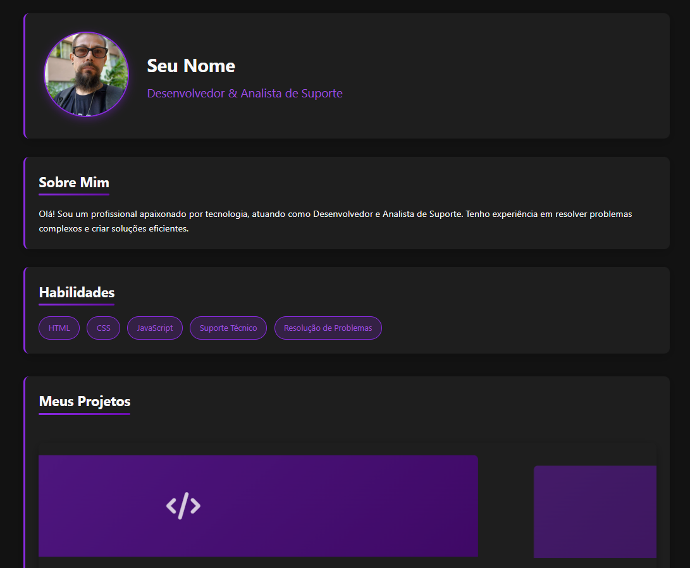

# Landing Page de Portfólio Pessoal



## 📋 Sobre o Projeto

Esta é uma landing page moderna e responsiva para portfólio pessoal, desenvolvida com HTML, CSS e JavaScript puro. O design apresenta um tema escuro com detalhes em roxo/lilás, oferecendo uma experiência visual atraente e profissional para desenvolvedores e profissionais de tecnologia apresentarem seu trabalho e habilidades.

## ✨ Funcionalidades

- **Design Responsivo**: Adaptação perfeita para dispositivos móveis, tablets e desktops
- **Tema Escuro**: Interface moderna com tema escuro e detalhes em roxo/lilás
- **Animações Suaves**: Efeitos de entrada, digitação e interações visuais
- **Carrossel de Projetos**: Exibição interativa de projetos com efeitos 3D
- **Efeitos Visuais**: Animações em hover, ripple effect nos botões e transições suaves
- **Suporte a Gestos**: Navegação por swipe no carrossel em dispositivos móveis

## 🛠️ Tecnologias Utilizadas

- **HTML5**: Estrutura semântica
- **CSS3**: Variáveis CSS, Flexbox, Grid, Animações e Media Queries
- **JavaScript**: Vanilla JS com manipulação avançada do DOM
- **Font Awesome**: Ícones vetoriais
- **Intersection Observer API**: Para animações de entrada

## 🚀 Como Usar

### Pré-requisitos

Não há pré-requisitos especiais para este projeto. Você só precisa de um navegador web moderno para visualizar a landing page.

## 🔧 Personalização

### Informações Pessoais

Edite o arquivo `index.html` para personalizar:

- Nome e profissão
- Texto "Sobre Mim"
- Habilidades
- Informações de contato
- Links para redes sociais

### Foto de Perfil

1. Substitua o arquivo `assets/profile-photo.jpg` pela sua própria foto
2. Para melhor resultado, use uma imagem quadrada

### Projetos

Edite a seção de projetos no arquivo `index.html` para adicionar seus próprios projetos:

```html
<div class="carousel-card">
    <div class="project-card">
        <div class="project-image">
            <div class="project-overlay">
                <i class="fas fa-code"></i> <!-- Ícone do projeto -->
            </div>
        </div>
        <div class="project-info">
            <h3>Nome do Projeto</h3>
            <p>Descrição do projeto</p>
            <div class="project-tags">
                <span class="project-tag">Tecnologia 1</span>
                <span class="project-tag">Tecnologia 2</span>
            </div>
            <a href="https://github.com/seu-usuario/projeto" class="project-link" target="_blank">
                <i class="fab fa-github"></i> Ver no GitHub
            </a>
        </div>
    </div>
</div>
```

### Cores e Tema

Para alterar o esquema de cores, edite as variáveis CSS no arquivo `styles.css`:

```css
:root {
    --bg-dark: #121212;      /* Cor de fundo principal */
    --bg-card: #1e1e1e;      /* Cor de fundo dos cards */
    --primary: #8a2be2;      /* Cor primária (roxo vibrante) */
    --primary-light: #9d4edd; /* Variação mais clara da cor primária */
    --accent: #6a0dad;       /* Cor de destaque (roxo mais escuro) */
    --text-light: #f8f8f8;   /* Cor do texto claro */
    --text-gray: #b3b3b3;    /* Cor do texto secundário */
    --gradient: linear-gradient(135deg, #8a2be2, #6a0dad); /* Gradiente */
}
```

## 📱 Responsividade

A landing page é totalmente responsiva e se adapta a diferentes tamanhos de tela:

- **Desktop**: Layout completo com todos os recursos visuais
- **Tablet**: Layout adaptado com ajustes de tamanho e espaçamento
- **Mobile**: Layout simplificado com navegação otimizada para toque


## 📬 Contato

Seu Nome - [Douglas Stefanski](do.stefanski@gmail.com)

Link do Projeto: [https://github.com/seu-usuario/landing-page-portfolio](https://github.com/seu-usuario/landing-page-portfolio)

---

⭐️ Desenvolvido com ❤️ por [Douglas Stefanski](https://github.com/dostefanski)
